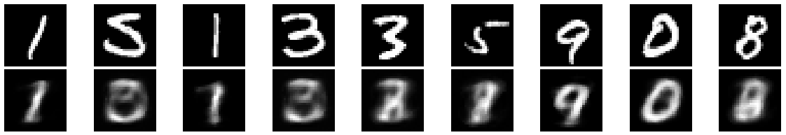
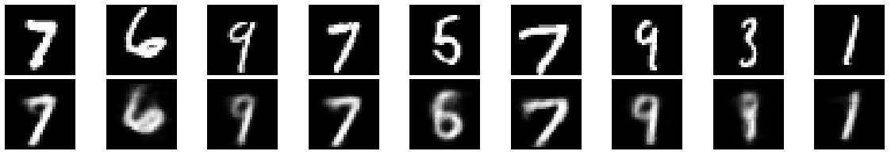
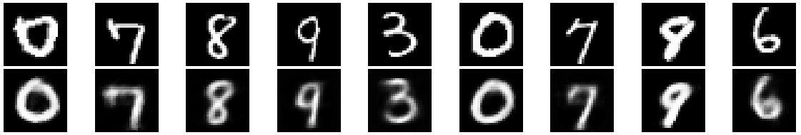

Autoencoder that compresses MNIST digit images from 784 pixels to just 3 numbers and reconstructs them back

Architecture: 784 → 128 → 64 → 32 → 8 → 32 → 64 → 128 → 784  
Compression ratio: 198x compression

<table>
  <tr>
    <td><b>Original & Reconstructed Images - Epoch 1</b></td>
  </tr>
  <tr>
    <td></td>
  </tr>
  <tr>
    <td><b>Original & Reconstructed Images - Epoch 15</b></td>
  </tr>
  <tr>
    <td></td>
  </tr>
  <tr>
    <td><b>Original & Reconstructed Images - Epoch 30</b></td>
  </tr>
  <tr>
    <td></td>
  </tr>
</table>

## Setup

**Requirements:** Python 3.11+, NVIDIA GPU with CUDA drivers

1.  create virtual environment

```
py -m venv venv
```

2.  activate it

```
venv\Scripts\activate
```

3.  install dependencies

```
pip install -r requirements.txt
```

4. verify GPU:

```
python
import torch
print(f"PyTorch version: {torch.__version__}")
print(f"CUDA available: {torch.cuda.is_available()}")
print(f"CUDA version: {torch.version.cuda}")
print(f"GPU: {torch.cuda.get_device_name(0)}")
print(f"Number of GPUs: {torch.cuda.device_count()}")
```

## Usage

1. train the model

```bash
cd src
python autoencoder.py
```

output:

- trains for 10 epochs
- saves results to `checkpoints/autoencoder_checkpoint.pth`
- shows training progress

2. Visualize Results

```bash
cd src
python visualize.py
```

output:

- loads saved checkpoint
- fisplays original vs reconstructed images from epochs first, middle, last

## Project Structure

```
autoencoder-PyTorch/
├── src/
│   ├── autoencoder.py          # train the model
│   └── visualize.py            # visualize results
├── checkpoints/                # saved models
├── data/                       # MNIST dataset (gitignored)
├── requirements.txt
└── README.md
```
